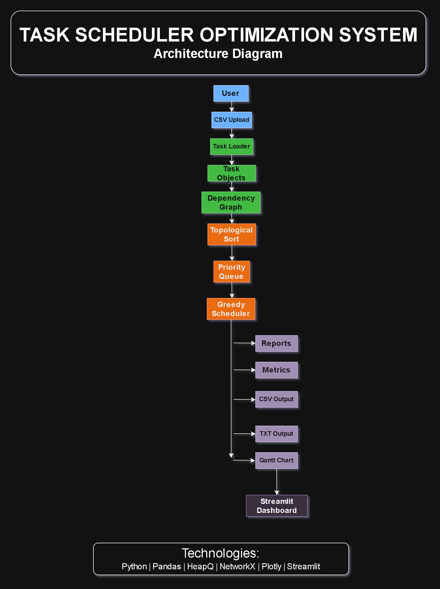
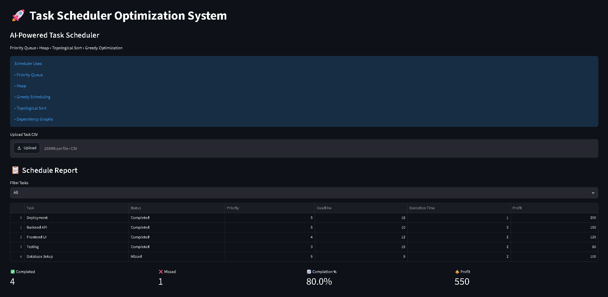
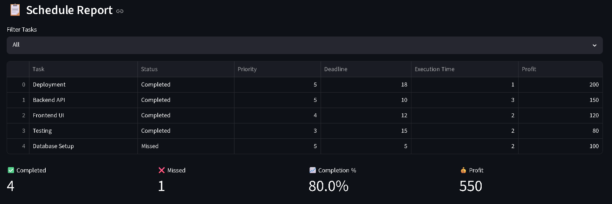
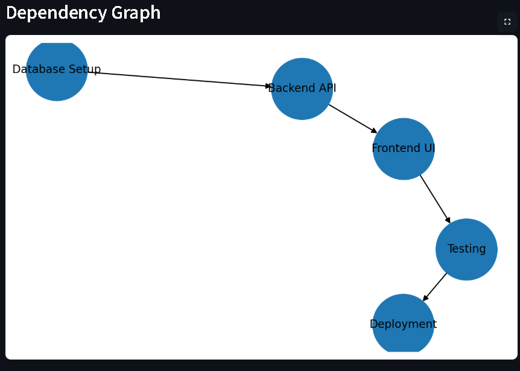
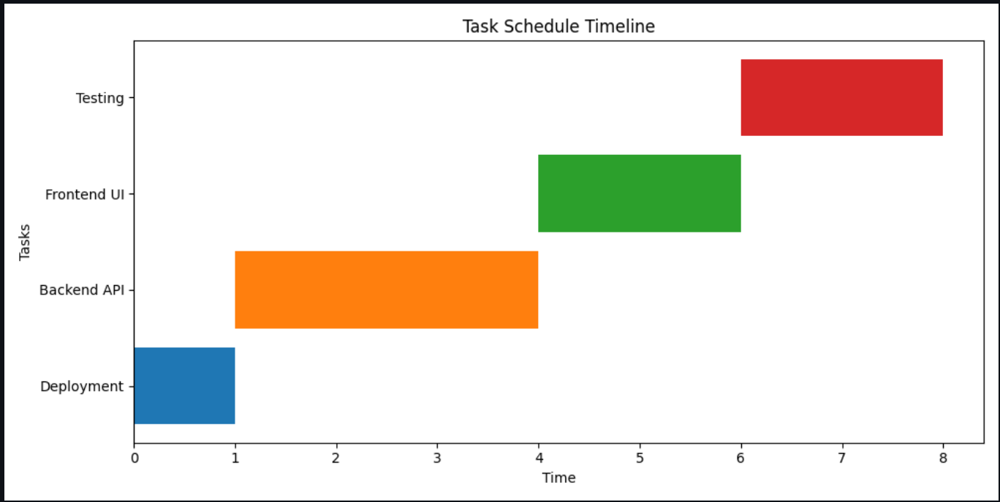

# 🚀 Task Scheduler Optimization System

An intelligent task scheduling platform that optimizes task execution using **Priority Queues, Heaps, Greedy Scheduling, Dependency Graphs, and Topological Sorting**.

The system analyzes task priorities, deadlines, dependencies, execution times, and profits to generate an optimized schedule while maximizing task completion efficiency.

---

## 🌐 Live Demo

**Streamlit App:**
https://task-scheduler-optimization-system-rpqtrh7vvukfkrvgck9bvi.streamlit.app/

---

## 💻 GitHub Repository

**Source Code:**
https://github.com/Vayu-143/task-scheduler-optimization-system

---

# 📌 Project Overview

Task scheduling is a common problem in:

* Operating Systems
* Cloud Computing
* Workflow Management
* Project Planning
* Resource Optimization

This project implements a scheduling engine that:

* Reads tasks from CSV files
* Builds dependency relationships
* Performs Topological Sorting
* Uses Priority Queue scheduling
* Applies Greedy Optimization
* Generates reports and visualizations
* Displays analytics through an interactive Streamlit Dashboard

---

# ✨ Features

## Task Management

* CSV-based task input
* Priority handling
* Deadline awareness
* Profit optimization
* Execution time tracking

## Advanced Scheduling

* Heap-based Priority Queue
* Greedy Scheduling Algorithm
* Dependency Graph Construction
* Topological Sort Scheduling
* Deadline Validation

## Reporting

* CSV Report Generation
* TXT Report Generation
* Performance Metrics

## Visualization

* Interactive Dashboard
* Gantt Chart
* Dependency Graph
* Completion Analytics
* Profit Analysis
* Priority Distribution

## Dashboard Features

* CSV Upload
* Interactive Filters
* KPI Cards
* Pie Charts
* Bar Charts
* Dependency Visualization

---

# 🏗️ System Architecture



---

# ⚙️ Algorithms Used

## 1. Heap (Priority Queue)

Tasks are stored inside a heap structure for efficient scheduling.

### Complexity

```text
Insertion : O(log n)
Deletion  : O(log n)
Peek      : O(1)
```

---

## 2. Greedy Scheduling

Tasks with the highest priority are selected first while respecting deadlines.

### Objective

```text
Maximize Total Profit
Minimize Missed Tasks
```

---

## 3. Dependency Graph

A Directed Graph is created where:

```text
Task A → Task B
```

means:

```text
Task A must complete before Task B
```

---

## 4. Topological Sort

Used to generate a valid execution order for dependent tasks.

### Complexity

```text
O(V + E)
```

Where:

```text
V = Vertices (Tasks)
E = Dependencies
```

---

# 📂 Project Structure

```text
task-scheduler-optimization-system/
│
├── .streamlit/
│   └── config.toml
│
├── data/
│   └── tasks.csv
│
├── docs/
│   ├── architecture.md
│   └── project_documentation.md
│
├── images/
│   ├── architecture.png
│   ├── dashboard.png
│   ├── dependency_graph.png
│   ├── gantt_chart.png
│   ├── metrics.png
│   ├── terminal_output.png
│   └── folder_structure.png
│
├── outputs/
│   ├── schedule_report.csv
│   ├── schedule_report.txt
│   └── gantt_chart.png
│
├── src/
│   ├── task.py
│   ├── utils.py
│   ├── scheduler.py
│   ├── dependency_scheduler.py
│   ├── report_generator.py
│   ├── gantt_chart.py
│   └── metrics.py
│
├── dashboard.py
├── main.py
├── requirements.txt
└── README.md
```

---

# 📊 Dashboard Preview

## Main Dashboard



---

## Performance Metrics



---

## Dependency Graph



---

## Gantt Chart



---

# 📈 Sample Workflow

```text
User
 │
 ▼
CSV Upload
 │
 ▼
Task Loader
 │
 ▼
Task Objects
 │
 ▼
Dependency Graph
 │
 ▼
Topological Sort
 │
 ▼
Priority Queue
 │
 ▼
Greedy Scheduler
 │
 ├── Reports
 │
 ├── Metrics
 │
 ├── CSV Output
 │
 ├── TXT Output
 │
 └── Gantt Chart
 │
 ▼
Streamlit Dashboard
```

---

# 📄 Sample Dataset

```csv
Task,Priority,Deadline,ExecutionTime,Profit,DependsOn
Database Setup,5,5,2,100,
Backend API,5,10,3,150,Database Setup
Frontend UI,4,12,2,120,Backend API
Testing,3,15,2,80,Frontend UI
Deployment,5,18,1,200,Testing
```

---

# 🛠️ Installation

## Clone Repository

```bash
git clone https://github.com/Vayu-143/task-scheduler-optimization-system.git

cd task-scheduler-optimization-system
```

---

## Create Virtual Environment

```bash
python -m venv venv
```

### Windows

```bash
venv\Scripts\activate
```

### Linux / Mac

```bash
source venv/bin/activate
```

---

## Install Dependencies

```bash
pip install -r requirements.txt
```

---

# ▶️ Run Project

### Execute Scheduler

```bash
python main.py
```

### Launch Dashboard

```bash
streamlit run dashboard.py
```

---

# 📊 Generated Outputs

After execution:

```text
outputs/
│
├── schedule_report.csv
├── schedule_report.txt
└── gantt_chart.png
```

---

# 🎯 Performance Metrics

The system calculates:

* Completed Tasks
* Missed Tasks
* Completion Percentage
* Total Profit
* Task Distribution
* Priority Distribution

---

# 🔥 Technologies Used

## Languages

* Python

## Libraries

* Pandas
* Streamlit
* Plotly
* Matplotlib
* NetworkX
* Heapq

## Concepts

* Data Structures
* Algorithms
* Graph Theory
* Scheduling Systems
* Visualization
* Analytics Dashboard

---

# 📚 Learning Outcomes

This project demonstrates practical implementation of:

* Heap Data Structure
* Priority Queue
* Graphs
* Topological Sorting
* Greedy Algorithms
* Scheduling Optimization
* Data Visualization
* Dashboard Development
* Report Generation

These concepts are commonly used in:

* Operating Systems
* Workflow Engines
* Cloud Schedulers
* Project Management Systems
* Resource Allocation Platforms

---

# 👨‍💻 Author

## Vayunandan Mishra

Electronics and Communications Engineering Student

### Connect

GitHub:
https://github.com/Vayu-143

---

# ⭐ If you found this project useful, consider giving it a star on GitHub!
